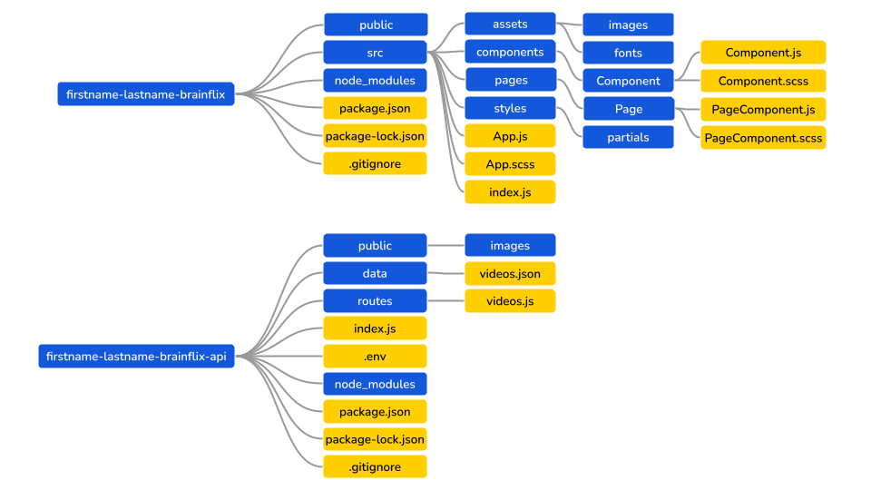

# Matthew Simpson - BrainFlix Project - BrainStation Summer 2022

## Sprint 3 - Back End

### Notes/Instructions

The server runs on port 8888. I have saved the server URL string in a JSON file with the key:value pair:
`{"newApiBaseUrl": "http://localhost:8888"}`

### Print 2 Feedback

- Consider renaming your components that are named after HTML elements. For example, Header could become PageHeader. This would be a more descriptive name, and wouldn’t confuse other developers.
- ✅ You can delete the data json files used for previous sprint, as we are not using them anymore.
- ✅ If you are ignoring your api data, consider adding some installation instructions and examples in your README, so that others who try to run your project have an idea how to set it up. You can also look into dotenv (.env) to set them as environment variables.
- ✅ When at your ‘/video/id’ route, regardless of the id within the route, when you refresh your page, it goes back to BMX video. Look into ways you can fix this from happening.
- 📝 For your video description input, consider making it a textarea to match the mockup.
  - 📝 It is one already!
- Consider passing down a clickHandler prop for your publish Button and cancel Button on your upload form or modify your Button component to resolve the error on clicking the publish and cancel button.

### API Server - Functional Requirements

- The end-points and response structure of your API server must match that of the mock API server.
- The API must have the following end-points:
  - ✅ `GET` `/videos` that responds with an array of videos.
  - ✅ `GET` `/videos/:id` that responds with an object containing the details of the video with an id of :id.
  - `POST` `/videos` that will add a new video to the video list. A unique id must be generated for each video added.
- Submitting a new video from the form must POST to the API. There is no requirement for a user to upload the image, therefore you as the developer must provide the hard-coded image path for the video thumbnail on the front-end during the form submission within the request body.
- ✅ Images should be served as static assets from the Node server.
  - Including the image used for creating a new video via Upload Form
- The data should persist on the server. If you restart Node server, the data shouldn't reset. This means you need to use a JSON file for persistence, writing to it, and reading from it.
- ✅ You should have a single source of truth for your data. Only one JSON file should be used to store all the data on your server.
  - Since you are now creating your own REST API, you now have to think about how you will use your one data file to mimic the API response from Sprint 2. One endpoint will return a small amount of data for each video that exists, the second endpoint will return all the data for one specific video. Think about how you may use your data file to achieve this within your project.

### Implementation Requirements

- ✅ Your project must follow the proper folder structure and naming convention outlined in the Project Guidelines section in Synapse and the Sprint 3 folder Structure Diagram.

## Sprint 3 - Front End

### Video Upload Page

- With the "Video Upload" page now created, add the actual upload functionality. Specifically, this should include an event handler for the upload form so that when a user submits a new video, it posts the video to your API in order to save it to the list of videos. A new video needs to be persisted in a JSON file with the app data.
- There is no requirement for uploading an image file, instead, you need to hardcode an image path when creating a new video, corresponding to a static asset path from the Node server.
- Since the upload form only has title and description input fields, feel free to fill any missing data for a new video object with placeholder values, not with extra form inputs.

### Visual Design Requirements

- ✅ The site must be responsive at and between breakpoints. Therefore it should closely resemble the mockups in the design package.
- Any inconsistencies with the design that exist from previous sprints should be resolved so that the final app matches the mockups as closely as possible.
- Any feedback that has been provided around the visual design from previous Sprints must be incorporated into this final Sprint. This Sprint represents the completed product that the “client” has requested.

### Implementation Requirements

- Any feedback that has been provided around your implementation from previous sprints must be incorporated into this final Sprint. This Sprint represents the completed product that the “client” has requested. If you have questions about how to implement a piece of feedback, ask someone from the Education Team.
- ✅ Your project must follow the proper folder structure and naming convention outlined in the Project Guidelines section in Synapse and the Sprint 3 folder Structure Diagram.
- ✅ The site must make use of the provided assets.
- ✅ The app must use multiple React components as discussed in class.
- ✅ The app must use react-router-dom with multiple routes, one for each page.
- ✅ The project's CSS must use SASS variables.
- ✅ The CSS must use BEM principles when naming classes.
- ✅ The site should use Flexbox for layout control.

#### Structure Diagram

.
.
.
.
.
.
.
.
.
.
.
.
.
.
.
.
.
.
.

## Sprint 2

### Sprint 1 Feedback

- ✅ Good job using multiple components to build your project. Remember to always have components within their own component folder, and not nest different components within components, or have multiple components in one folder. (https://reactjs.org/docs/faq-structure.html)
- ✅ Ensure to remove commented out code or code that is not being used anywhere before submission.
- ✅ Consider making the comment input a <textarea> to match the mock up.
- ✅ You can link your BrainFlix logo to homepage.
- ✅ In your scss files, consider removing @use of any partials you're not actually using in a particular scss file
- Consider removing the bottom border of the comments section (the border bottom of last comment) on desktop size to match the mockup.`
- ✅ On desktop size, there is a grey border between the left and right section under the hero video. Make sure your site looks as close to the mockups as possible
- 📝 When naming variables, consider what the variable represents rather than descriptives for best practice. (i.e. don't use 'BrainFlix-PrimaryBlue', instead consider 'button-color' etc) - Consider using kebab-case for your scss variables consistently.
  - 📝 Feedback recevied, but not impliemented for this project.
- ✅ Consider giving your comment input box a background color that matches the mock up, as well as your search input box on the header.
- ✅ Try to increase the font weight of the video title to match the mockup.
- ✅ Try to import in the direct component when you are using the import. Avoid importing in parent component and passing down as props. (eg. userimg, userimg). - Try to be consistent when naming variables using camelCase in js components. (eg. try to name as userImg instead of userimg).

### Functional Requirements

- ✅ Clicking the BrainFlix Logo must link back to the home page (the page with the default video - which will be the first video in the side-videos list).
- There must be 3 routes:
  - ✅ The `Home/Video Player` Page for displaying the details of a video.
  - ✅ The `Video Upload` Page.
  - ✅ A route that will load the video with the provided `video id` to be displayed using the `Video Player Page`.
- ✅ Clicking on a video in the “Next Video” list must go to the `Video Details` Page for the selected video via routing and display all the information for the video such as (likes, views, author, comments, etc).
- ✅ Clicking on the `“Upload”` button must link to the Video Upload Page.

### Visual Design Requirements

- ✅ The site must be responsive at and between breakpoints. It must closely resemble the mockups in the design package.

### Implementation Requirements

- ✅ Your project must follow the proper folder structure and naming convention outlined in the Project Guidelines section in Synapse and the Sprint 2 Folder Structure Diagram.
- ✅ The site must make use of the provided assets.
- ✅ The app must use react-router-dom with multiple routes, one for each page.
- ✅ The app must use multiple React components as discussed in class.
- ✅ The project's CSS must use SASS variables.
- ✅ The CSS must use BEM principles when naming classes.
- ✅ The site should use Flexbox for layout control.

### Main Video Page

- ✅ Home Page and Video Details Page should use the same Page Component, and use two separate routes, one for home and the other for a selected video. Think of a unique property of a video object that you could incorporate into your route definition.
  - ✅ For the Home Page, the video that should be displayed is the first video within the array of videos.
  - ✅ For the Video Details Page, the video that should be displayed is the selected video within the array of videos.
- ✅ You must use the useEffect hook as well as the useParams hook from react-router to determine when to update the main-video data.
- ✅ Clicking on a video thumb in the side-videos section should update the URL. Do not use a click handler to update state for this scenario. This means you need to refactor Sprint 1 functionality to utilize the React Router for this Sprint.

### Video Upload Page

- ✅ The Video Upload Page must match the provided mockup. Upload functionality is not required for this sprint.
- ✅ After form submission, it should notify about “upload” and redirect to a home page with the default video selected.

### Video API

- ✅ ata displayed in the app must be retrieved from the provided mock API using axios.
- ✅ The site must use the provided API to retrieve the video links and video details.
- ✅ The site must use the comments provided with the video details response.
- ✅ All data for videos and comments must come from the provided mock API.

### Diving Deeper / Posting Comments

To add another layer of functionality to the site, try adding the ability to post and delete comments. Regarding the technical implementation, the following requirements should be met:

- When posting a comment, ensure that the page does not refresh.
- You must POST a comment to the API.
- If successful in posting the comment, render the new comment by sending a new request for the "Main Video" data.
- After deleting a comment using the API endpoint, your comment section should update without refreshing the browser.

## Sprint 1

### Project Overview

You have been approached by an entrepreneur to build out a prototype for a new video streaming platform called BrainFlix. The entrepreneur has meetings lined up for funding with several VCs and needs the prototype built within the next three weeks. BrainFlix’s Creative Director has provided you with a package and mockup of how they envision the final product. There is also a separate team that is currently working on a backend API needed to integrate with the front-end, but for the time being the static components need to be put together.

It will be your job to create a functioning and responsive app prototype from the project designs provided.

To submit this deliverable, ensure you merge your develop branch with the main branch. In addition, create a text document with a link to your GitHub repository and upload to Synapse before the submission deadline.

### Functional Requirements

- ✅ The ”Next Video” sidebar must not contain the current video being displayed.
- ✅ Components should render using dynamic data, not hardcoded HTML (eg. comments, current video, and video-list sections).
- ✅ Side Videos should be clickable and upon selecting a video you should update the Main Video section to display the details and comments of a new video. Think of which React concept you could use to update the UI based on user interaction.

### Visual Design Requirements

- ✅ The site must be responsive at and between breakpoints, and should closely resemble the mockups in the design package.

### Implementation Requirements

- ✅ Your project must follow the proper folder structure and naming convention outlined in the Project Guidelines section in Synapse and the Sprint 1 Folder Structure Diagram.
- ✅ The site must make use of the provided assets.
- ✅ The site must be composed of multiple React components.
- ✅ The site must use the `<video>` tag for the video player.
- ✅ Although the `<video>` tag will not be functional for this sprint, all visual elements of the video player must exist on the deliverable without functionality.
  - ➡API data is in place for video playback to function, and commented out.
- ✅ Use the poster attribute to have the video player resemble the mockup.
- ✅ Video controls should be the default `<video>` controls. Don’t worry if the default styling doesn’t match the mockups, re-styling them will be part of the later sprint.
- ✅ Using both of the data files provided from the assets, you must use state to hold the data and pass it down as props to generate side-videos and main-video content including comments.
- ✅ The data files provided are meant to mimic a REST API response, where one endpoint will return a small amount of data for each video that exists, the second endpoint will return all the data for one specific video. Think about how you may use the data files provided to achieve this within your project.
- ✅ The main-video should be included in the side-videos array held in state (with the same object keys as other side-video objects) and filtered out of the side-videos section programmatically when rendering the component.
- ✅ The main-video object, with extended properties, should be held in a separate portion of state
- ✅ The comments-section form doesn’t need to be functional. You don’t need to be able to post new comments for this Sprint, but the comments still need to be rendered dynamically (data coming from comments property of the main-video object stored in state).
- ✅ You must use SASS for your styling and take advantage of SASS variables, plus any other SASS features that can help improve your code.
- ✅ Class naming for your styling must use BEM.
- ✅ Layout of the site must use Flexbox.

### Diving Deeper Dynamic Timestamp

- ✅ To add a more refined feel to the site, let's update the timestamp in the comments section and video details to reflect when it was posted in a more human-readable format. Using YouTube as an example, a recently posted comment might display the time posted as "10 minutes ago" or "3 days ago". Apply this type of timestamp to your data without hardcoding the actual message.
  - There are two utility functions.
    - `formatDate` will return the date in the specific MM/DD/YYYY format.
    - `readableDate` returns a string relative to `Date.now()`
